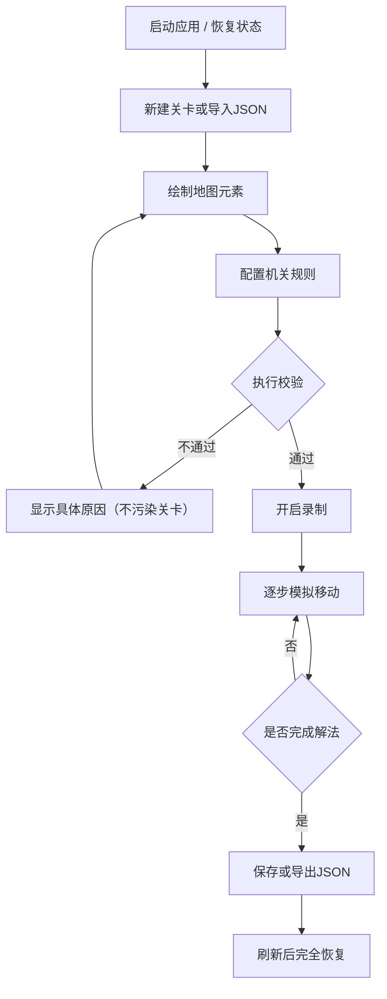

## 1. 产品概述

回合制谜题关卡编辑与回放工具是一款纯前端浏览器应用，专为谜题游戏设计者打造。设计者可通过可视化网格编辑器创建关卡，配置墙、起点、目标、箱子、机关等元素，录制解法步骤，并对所有操作进行撤销、重做、导入、导出。工具内置校验机制，确保关卡合法可玩，支持刷新页面后状态完全恢复。

- 核心目的：为推箱子、开关谜题型游戏提供低门槛的关卡设计与验证工具
- 目标用户：独立游戏开发者、谜题爱好者、教育工作者

## 2. 核心特性

### 2.1 功能模块

1. **网格地图编辑器**：尺寸可调，点击/拖拽放置或擦除各类图块
2. **规则配置面板**：机关-门关联、箱子推放规则、胜利条件设定
3. **移动模拟器**：方向键/WASD 或按钮操作，实时模拟玩家移动与推箱子
4. **解法录制器**：记录每一步操作，支持逐帧回放、跳转到指定步骤
5. **撤销/重做系统**：对地图编辑和规则配置提供完整的操作历史栈
6. **导入/导出**：JSON 格式完整序列化关卡（地图+规则+解法），支持草稿自动保存
7. **校验引擎**：静态合法性检查 + 可达性分析，给出具体错误原因且不污染当前关卡
8. **持久化层**：localStorage 完整保存当前关卡、移动日志、撤销栈、校验结果

### 2.2 页面详情

| 页面名称 | 模块名称 | 功能描述 |
|-----------|-------------|---------------------|
| 主工作台 | 顶部工具栏 | 新建/导入/导出/保存草稿/撤销/重做/校验/样例关卡 |
| 主工作台 | 左侧工具箱 | 图块选择（空/墙/起点/目标/箱子/机关/门/地板） |
| 主工作台 | 中央画布 | 网格地图编辑器（支持点击、拖拽绘制、缩放） |
| 主工作台 | 右侧规则面板 | 机关配置、胜利条件、规则说明 |
| 主工作台 | 底部控制栏 | 模拟移动按钮、步骤列表、播放/暂停/重置、录制开关 |
| 主工作台 | 状态提示区 | 校验结果、错误原因、操作反馈浮层 |

## 3. 核心流程

### 主工作流
设计者选择工具 → 在网格上绘制地图 → 配置机关与门的关联 → 点击校验确认合法 → 开启录制模式 → 逐步模拟移动解关 → 保存草稿或导出 JSON → 分享关卡文件

### 校验与错误隔离
校验采用「快照比对 + 临时副本」策略：先对当前关卡做深拷贝，在副本上执行所有检查。若发现错误，仅在 UI 显示原因，绝不修改用户正在编辑的关卡数据和撤销栈。

### 规则变更处理
规则（机关-门映射、胜利条件）变更后，自动标记现有解法步骤为「失效」，并提示用户需要重新录制。失效的步骤不会立即删除，而是保留在列表中以灰色显示，允许用户参考后手动清除或接受重新录制。

## 4. 用户界面设计

### 4.1 设计风格
- **主色调**：深海蓝 #0f172a 作为背景基底，搭配琥珀金 #f59e0b 作为操作强调色，翡翠绿 #10b981 表示校验通过，珊瑚红 #ef4444 表示错误
- **按钮风格**：胶囊形圆角按钮，按下有轻微凹陷反馈，悬停时光晕扩散
- **字体**：JetBrains Mono 作为代码/数字显示，配合思源黑体中文显示
- **布局风格**：左右分栏 + 中央画布，玻璃拟态（backdrop-filter）面板边缘带细发光边框
- **图标/emoji**：lucide-react 图标配合 emoji 图块（🧱墙、🚶起点、🎯目标、📦箱子、🔘机关、🚪门）

### 4.2 页面设计概览

| 页面名称 | 模块名称 | UI 元素 |
|-----------|-------------|-------------|
| 主工作台 | 顶部工具栏 | 玻璃拟态栏，图标+文字按钮组，撤销重做快捷键提示 |
| 主工作台 | 左侧工具箱 | 竖向卡片，当前选中工具高亮发光边框，支持数字键 1-8 切换 |
| 主工作台 | 中央画布 | 网格化渲染，鼠标悬停格高亮，选中工具下预览色，可滚轮缩放 |
| 主工作台 | 右侧规则面板 | 折叠式分组，机关-门连线可视化，表格化配置 |
| 主工作台 | 底部控制栏 | 方向键十字布局，步骤时间轴，录制按钮红色脉动 |
| 主工作台 | 状态提示区 | Toast 浮层从顶部滑入，错误红色、成功绿色、信息琥珀色 |

### 4.3 响应式
- 桌面端（≥1280px）：左右分栏完整显示，中央画布自适应
- 平板端（768-1279px）：右侧规则面板可折叠为抽屉
- 移动端（<768px）：工具箱转为顶部横向滚动条，画布全屏显示
