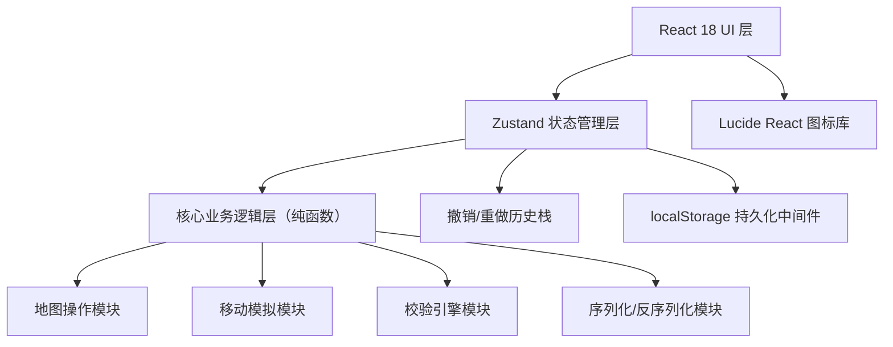

## 1. 架构设计



## 2. 技术描述
- 前端：React@18 + TypeScript@5 + Tailwind CSS@3 + Zustand@4 + Vite@5
- 初始化工具：vite-init（react-ts 模板）
- 后端：无（纯前端浏览器应用）
- 数据库：浏览器 localStorage 作为持久化存储
- 图标库：lucide-react
- 额外依赖：无（所有算法用原生 TS 实现）

## 3. 路由定义

| 路由 | 用途 |
|-------|---------|
| / | 主工作台（唯一页面，所有功能集中） |

本工具为单页应用，不涉及多路由切换。

## 4. 数据模型

### 4.1 核心类型定义

```typescript
// 图块类型
enum TileType {
  EMPTY = 0,      // 空地/可通行
  WALL = 1,       // 墙（不可通行）
  START = 2,      // 起点
  TARGET = 3,     // 目标点（箱子需要推到此处）
  BOX = 4,        // 箱子
  SWITCH = 5,     // 机关/压力板
  DOOR = 6,       // 门（受机关控制）
  FLOOR = 7,      // 装饰地板（可通行）
}

// 单个位置坐标
interface Position {
  x: number;
  y: number;
}

// 机关-门关联
interface SwitchDoorRule {
  switchId: string;          // 对应某个 SWITCH 位置的唯一标识
  doorPositions: Position[]; // 该机关控制的门的位置
  inverted: boolean;         // 是否反向（按下机关时关门而非开门）
}

// 胜利条件
enum WinCondition {
  ALL_BOXES_ON_TARGETS = 'all_boxes_on_targets',  // 所有箱子推到目标
  REACH_TARGET = 'reach_target',                   // 玩家到达目标点
  ALL_SWITCHES_PRESSED = 'all_switches_pressed',   // 所有机关被按下
}

// 规则配置
interface LevelRules {
  switchDoors: SwitchDoorRule[];
  winCondition: WinCondition;
  allowPushBoxOnSwitch: boolean;  // 箱子是否可以压在机关上
  playerCanWalkOnSwitches: boolean;
}

// 移动方向
enum Direction {
  UP = 'UP',
  DOWN = 'DOWN',
  LEFT = 'LEFT',
  RIGHT = 'RIGHT',
}

// 单步移动记录
interface MoveStep {
  direction: Direction;
  timestamp: number;
  playerFrom: Position;
  playerTo: Position;
  pushedBoxIndex?: number;   // 如果推动了箱子，记录箱子编号
  boxFrom?: Position;
  boxTo?: Position;
  activatedSwitches?: string[];  // 触发的机关ID
}

// 关卡校验结果
interface ValidationResult {
  valid: boolean;
  errors: ValidationError[];
  warnings: ValidationWarning[];
}

interface ValidationError {
  code: string;       // 错误码
  message: string;    // 用户可见描述
  position?: Position; // 关联位置（可选）
}

interface ValidationWarning {
  code: string;
  message: string;
  position?: Position;
}

// 完整关卡数据（可序列化导出）
interface LevelData {
  version: string;          // 数据结构版本号
  name: string;             // 关卡名称
  width: number;
  height: number;
  tiles: TileType[][];      // 二维网格，[y][x]
  boxes: Position[];        // 箱子初始位置（与TILE中的BOX保持一致，冗余便于快速查找）
  playerStart: Position;    // 玩家起点
  targets: Position[];      // 目标点列表
  switches: { pos: Position; id: string }[];  // 带ID的机关列表
  doors: Position[];        // 门的位置列表
  rules: LevelRules;
  moveLog: MoveStep[];      // 解法步骤
  moveLogInvalidated: boolean;  // 规则变更后日志是否失效
  createdAt: number;
  updatedAt: number;
}

// 应用状态（含撤销栈）
interface HistoryState {
  past: LevelData[];        // 可撤销的历史快照
  present: LevelData;       // 当前状态
  future: LevelData[];      // 可重做的未来快照
  lastValidation: ValidationResult | null;
}
```

### 4.2 localStorage 持久化键

| 键名 | 内容 |
|------|------|
| puzzle-editor:v1:state | 完整的 HistoryState JSON 字符串（含 past/present/future + 校验结果） |
| puzzle-editor:v1:last-saved | 上次自动保存时间戳 |

## 5. 核心算法模块

### 5.1 地图操作模块 `src/utils/mapOps.ts`
- `createEmptyMap(width, height)` → 创建空地图
- `setTile(map, x, y, tile)` → 设置单个图块（返回新数组，不修改原数组）
- `resizeMap(map, newW, newH, fill)` → 调整尺寸
- `findPositions(map, tileType)` → 查找指定类型所有位置
- `validatePositionsNonOverlap(data)` → 检查关键元素是否重叠

### 5.2 移动模拟模块 `src/utils/simulation.ts`
- `simulateMove(state, direction)` → 尝试一步移动，返回新状态或 null（失败）
- `canMoveTo(map, pos, doorsOpen)` → 检查位置是否可进入
- `computeDoorsOpen(level, allBoxes, playerPos)` → 根据机关状态计算门是否开启
- `checkWin(level, allBoxes, playerPos)` → 检查是否达成胜利条件
- `applyMoveLog(level, log)` → 重放整个步骤日志，返回最终状态

### 5.3 校验引擎模块 `src/utils/validator.ts`
- `validateLevel(level)` → 完整校验（深拷贝后执行，不修改原对象）
  - E001: 未设置目标点（targets 为空且胜利条件需要）
  - E002: 玩家起点缺失或多于一个
  - E003: 边界外存在关键元素
  - E004: 墙/门完全包围玩家或箱子
  - E005: 箱子数量与目标点数量不匹配（根据规则）
  - E006: 机关ID与规则不对应
  - E007: 导入 JSON 格式错误 / 字段缺失 / 类型不匹配

### 5.4 序列化模块 `src/utils/serializer.ts`
- `exportToJSON(level)` → 序列化为格式化 JSON 字符串
- `importFromJSON(str)` → 解析并校验结构，返回 [LevelData | null, 错误信息]
- `migrateLegacyFormat(obj)` → 版本号不匹配时尝试迁移
- `createSampleLevels()` → 返回 3 个预置样例关卡

## 6. Zustand Store 设计（`src/store/useEditorStore.ts`）

```
Action:
  - newLevel(width, height)       新建关卡（清空撤销栈）
  - setTile(x, y, tile)           设置图块（推入撤销栈）
  - resizeMap(width, height)      调整尺寸（推入撤销栈）
  - updateRules(partialRules)     更新规则（推入撤销栈，标记 moveLogInvalidated=true）
  - undo()                        从 past 弹出
  - redo()                        从 future 弹出
  - startRecording()              开启录制
  - stopRecording()               停止录制
  - recordStep(direction)         模拟移动并记录到 moveLog（不入撤销栈）
  - clearMoveLog()                清空步骤
  - jumpToStep(index)             跳转到指定步骤（重放前 N 步）
  - validate()                    执行校验，保存结果
  - exportJSON()                  下载 JSON 文件
  - importJSON(fileContent)       导入（验证失败不污染当前状态）
  - saveDraft()                   手动触发持久化
  - restoreFromStorage()          启动时从 localStorage 恢复
```

持久化策略：每次 past/present 变更后通过 subscribe 中间件写入 localStorage（debounce 500ms）。导入操作采用「先完全解析校验 → 成功后替换整个 state → 推入一个新的 undo 起点」策略，失败则不改动任何数据。
